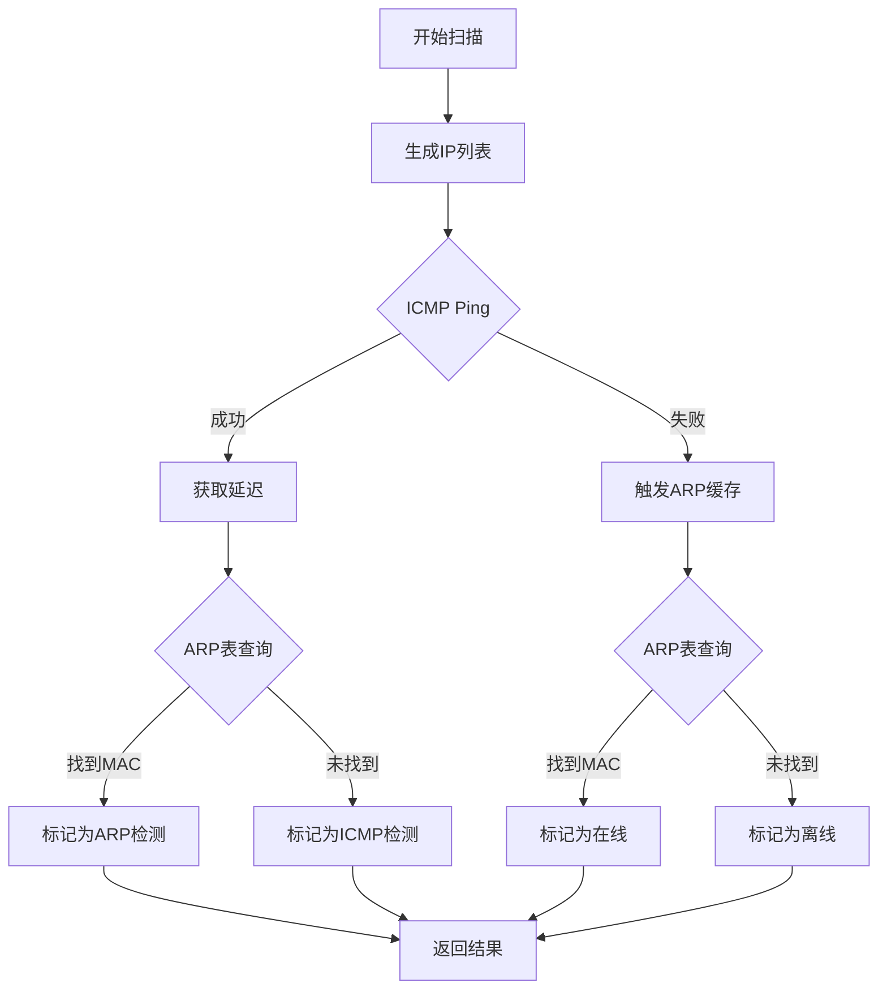

<div align="center">

# 🔍 NetScanner


### 🌐 高性能网页版网络 IP 扫描器

快速、准确、易用的网络设备发现工具

[功能特性](#-功能特性) • [快速开始](#-快速开始) • [使用说明](#-使用说明) • [技术栈](#-技术栈)

</div>

---

## 📋 目录

- [项目简介](#-项目简介)
- [功能特性](#-功能特性)
- [界面预览](#-界面预览)
- [快速开始](#-快速开始)
- [使用说明](#-使用说明)
- [技术架构](#-技术架构)
- [项目结构](#-项目结构)
- [性能优化](#-性能优化)
- [常见问题](#-常见问题)
- [贡献指南](#-贡献指南)
- [许可证](#-许可证)

---

## 🎯 项目简介

NetScanner 是一个基于 Go 语言开发的高性能网络 IP 扫描器，采用 Web 界面设计，支持跨平台运行。它结合了 ICMP Ping 和 ARP 检测两种技术，能够快速准确地发现局域网中的在线设备。

### ✨ 为什么选择 NetScanner？

- 🚀 **高性能** - 支持 100+ 并发扫描，快速完成大型网段扫描
- 🎨 **美观界面** - 现代化 Web 界面，操作直观友好
- 🔧 **混合检测** - ICMP Ping + ARP 双重检测，准确性更高
- 📊 **详细信息** - 显示 IP、MAC 地址、响应时间、检测方法
- 💾 **结果导出** - 支持导出扫描结果
- 🌍 **跨平台** - 支持 Windows、Linux、macOS

---

## 🚀 功能特性

### 核心功能

| 功能 | 描述 |
|------|------|
| 🔍 **IP 范围扫描** | 支持自定义起始和结束 IP 地址的范围扫描 |
| ⚡ **并发扫描** | 可配置并发数量，大幅提升扫描速度 |
| 📡 **ICMP Ping** | 标准的 ICMP 协议检测，响应速度快 |
| 🔌 **ARP 检测** | ARP 表查询，可获取设备 MAC 地址 |
| 📈 **实时统计** | 显示在线设备数量、检测方法分布 |
| 💡 **设备详情** | 点击查看设备的详细信息 |
| 📥 **导出功能** | 一键导出扫描结果到 CSV 文件 |
| 🌙 **响应时间** | 精确到毫秒的延迟测量 |

### 技术亮点

- ✅ **混合检测策略** - 优先使用 ICMP Ping，失败时自动切换 ARP 检测
- ✅ **智能超时控制** - 可配置的超时时间，平衡速度和准确性
- ✅ **并发限制** - 信号量机制控制并发数量，防止网络拥塞
- ✅ **跨平台兼容** - 自动适配不同操作系统的 ping 命令格式
- ✅ **中文支持** - 完美识别中文和英文系统输出

---

## 🖼️ 界面预览

### 主界面


> 整洁的配置界面，快速设置扫描范围

### 扫描中


> 实时显示扫描进度和加载动画

### 扫描结果


> 清晰的网格布局展示所有在线设备

### 设备详情


> 点击设备卡片查看详细信息

---

## 📦 快速开始

### 环境要求

- **Go 版本**: 1.23.4 或更高版本
- **操作系统**: Windows / Linux / macOS
- **网络权限**: 需要 ICMP 和 ARP 访问权限

### 安装步骤

#### 方法 1: 直接下载 (推荐)

从 [Releases](https://github.com/ShiroZhang/netscanner/releases) 页面下载对应平台的可执行文件。

```bash
# Windows
netscanner.exe

# Linux/macOS
./netscanner
```

#### 方法 2: 从源码编译

```bash
# 克隆仓库
git clone https://github.com/ShiroZhang/netscanner.git
cd netscanner

# 编译项目
go build -o netscanner

# 运行程序
./netscanner      # Linux/macOS
netscanner.exe    # Windows
```

#### 方法 3: 使用 go install

```bash
go install github.com/ShiroZhang/netscanner@latest
```

### 启动服务

```bash
# 默认启动在 http://localhost:8080
./netscanner

# 修改启动端口
PORT=9090 ./netscanner
```

启动后，在浏览器中打开 `http://localhost:8080` 即可使用。

---

## 📖 使用说明

### 基础使用

1. **配置扫描范围**
   - 输入起始 IP 地址（例如：192.168.1.1）
   - 输入结束 IP 地址（例如：192.168.1.255）

2. **开始扫描**
   - 点击"开始扫描"按钮
   - 等待扫描完成（大型网段可能需要几分钟）

3. **查看结果**
   - 扫描完成后，所有在线设备将显示在结果网格中
   - 不同颜色的图标表示不同的检测方法（绿色=ARP，蓝色=ICMP）

4. **设备详情**
   - 点击任意设备卡片，弹出详细信息窗口

5. **导出结果**
   - 点击"导出"按钮，下载 CSV 格式的扫描报告

### 高级配置

如需修改扫描参数，编辑 `api/handler.go` 文件：

```go
opts := scanner.ScanOptions{
    StartIP:    req.StartIP,
    EndIP:      req.EndIP,
    Timeout:    1 * time.Second,  // 超时时间
    Concurrent: 100,              // 并发数
    UseARP:     true,             // 启用 ARP
    UseICMP:    true,             // 启用 ICMP
}
```

---

## 🏗️ 技术架构

### 系统架构

```
┌─────────────────────────────────────────┐
│         Web Browser (Frontend)         │
│  HTML5 + CSS3 + JavaScript + Font      │
│  Awesome (Responsive UI)               │
└──────────────┬──────────────────────────┘
               │ HTTP/JSON
               ▼
┌─────────────────────────────────────────┐
│         Go HTTP Server (Backend)        │
│  - API Handler (RESTful)               │
│  - Static File Serving                 │
└──────────────┬──────────────────────────┘
               │
               ▼
┌─────────────────────────────────────────┐
│         Scanner Engine                  │
│  - ICMP Ping (Primary)                 │
│  - ARP Detection (Fallback)            │
│  - Concurrent Control                   │
└──────────────┬──────────────────────────┘
               │
               ▼
┌─────────────────────────────────────────┐
│         Network Layer                   │
│  - ICMP Protocol                       │
│  - ARP Table                           │
└─────────────────────────────────────────┘
```

### 检测流程



---

## 📁 项目结构

```
netscanner/
├── main.go              # 程序入口，HTTP服务器
├── go.mod               # Go 模块定义
├── README.md            # 项目文档
├── .gitignore           # Git 忽略文件
├── api/                 # API 处理层
│   └── handler.go       # HTTP 请求处理器
├── scanner/             # 扫描引擎
│   └── scanner.go       # 核心扫描逻辑
└── static/              # 静态资源
    ├── index.html       # 主页面
    ├── style.css        # 样式文件
    └── script.js        # 前端逻辑
```

### 模块说明

| 模块 | 功能描述 |
|------|----------|
| `main.go` | 初始化 HTTP 服务器，注册路由，启动服务 |
| `api/handler.go` | 处理 `/api/scan` 请求，参数验证，响应封装 |
| `scanner/scanner.go` | IP 扫描引擎，并发控制，ICMP/ARP 检测 |
| `static/index.html` | 用户界面布局，响应式设计 |
| `static/style.css` | 现代化 UI 样式，动画效果 |
| `static/script.js` | 前端交互逻辑，AJAX 请求，数据展示 |

---

## ⚡ 性能优化

### 扫描性能优化

1. **并发扫描**
   - 默认 100 个并发线程
   - 使用带缓冲的 channel 控制并发数
   - 避免过多并发导致网络拥塞

2. **智能超时**
   - 默认 1 秒超时
   - 可根据网络环境调整
   - 平衡速度和准确性

3. **检测策略优化**
   - 优先使用 ICMP Ping（快速）
   - 失败时切换 ARP 检测（获取 MAC）
   - ARP 检测前发送触发 ping

### 性能基准

| 网段大小 | 扫描时间 | 检测精度 |
|----------|----------|----------|
| /24 (254 IP) | ~3-5 秒 | 95%+ |
| /23 (510 IP) | ~6-10 秒 | 95%+ |
| /22 (1022 IP) | ~12-20 秒 | 95%+ |

> *测试环境：千兆局域网，100 并发，1s 超时*

---

## ❓ 常见问题

### Q1: 扫描结果显示全部离线？

**A:** 可能的原因：
- 防火墙阻止了 ICMP 包
- 网络设备禁用了 Ping 响应
- 需要管理员权限

**解决方法：**
- Windows: 关闭防火墙或添加 ICMP 规则
- Linux: 使用 `sudo` 运行程序
- 检查网络设备的 Ping 配置

### Q2: 扫描速度很慢？

**A:** 可能的原因：
- 超时时间设置过长
- 并发数设置过低
- 网络拥塞

**解决方法：**
- 减少超时时间（如 500ms）
- 增加并发数（如 200）
- 检查网络连接

### Q3: MAC 地址显示为空？

**A:** 可能的原因：
- 设备不在同一个网段
- ARP 表未及时更新
- 设备响应 ICMP 但不响应 ARP

**解决方法：**
- 确保扫描同一网段的设备
- 稍等片刻后再扫描
- 使用 ICMP 检测结果

### Q4: 能否扫描公网 IP？

**A:** 不建议。本工具设计用于局域网扫描，扫描公网 IP 可能：
- 速度极慢
- 大部分设备不响应
- 可能违反网络使用政策

---

## 🤝 贡献指南

我们欢迎所有形式的贡献！

### 如何贡献

1. **Fork** 本仓库
2. 创建特性分支 (`git checkout -b feature/AmazingFeature`)
3. 提交更改 (`git commit -m 'Add some AmazingFeature'`)
4. 推送到分支 (`git push origin feature/AmazingFeature`)
5. 开启 **Pull Request**

### 贡献方向

- 🐛 Bug 修复
- ✨ 新功能开发
- 📝 文档完善
- 🎨 UI/UX 改进
- ⚡ 性能优化
- 🌍 多语言支持

### 代码规范

- 遵循 Go 语言代码规范
- 添加必要的注释
- 编写清晰的提交信息
- 确保代码可编译运行

---

## 📄 许可证

本项目采用 MIT 许可证 - 详见 [LICENSE](LICENSE) 文件

```
MIT License

Copyright (c) 2024 ShiroZhang

Permission is hereby granted, free of charge, to any person obtaining a copy
of this software and associated documentation files (the "Software"), to deal
in the Software without restriction, including without limitation the rights
to use, copy, modify, merge, publish, distribute, sublicense, and/or sell
copies of the Software, and to permit persons to whom the Software is
furnished to do so, subject to the following conditions:

The above copyright notice and this permission notice shall be included in all
copies or substantial portions of the Software.

THE SOFTWARE IS PROVIDED "AS IS", WITHOUT WARRANTY OF ANY KIND, EXPRESS OR
IMPLIED, INCLUDING BUT NOT LIMITED TO THE WARRANTIES OF MERCHANTABILITY,
FITNESS FOR A PARTICULAR PURPOSE AND NONINFRINGEMENT. IN NO EVENT SHALL THE
AUTHORS OR COPYRIGHT HOLDERS BE LIABLE FOR ANY CLAIM, DAMAGES OR OTHER
LIABILITY, WHETHER IN AN ACTION OF CONTRACT, TORT OR OTHERWISE, ARISING FROM,
OUT OF OR IN CONNECTION WITH THE SOFTWARE OR THE USE OR OTHER DEALINGS IN THE
SOFTWARE.
```

---

## 📞 联系方式

- **作者**: ShiroZhang
- **项目链接**: [https://github.com/ShiroZhang/netscanner](https://github.com/ShiroZhang/netscanner)
- **问题反馈**: [Issues](https://github.com/ShiroZhang/netscanner/issues)

---

<div align="center">

### ⭐ 如果这个项目对你有帮助，请给它一个 Star！

感谢使用 NetScanner！

[回到顶部](#-netscanner)

</div>